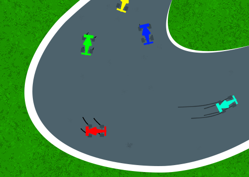

# Index/Landing Page

## Gameplay

μKarts (MicroKarts) plays like any other top-down vehicle game; the arrow keys are used for movement and space is for the handbrake. MicroKarts also has a car upgrading system that allows you to upgrade things such as the speed, acceleration, and handling.

## Proposal

μKarts (MicroKarts) is a new take on old 2D top-down racing games such as Retro Racing where you must race against other players or against a time. Unlike some of those old racing games, μKarts features an upgrade system that allows players to tune and refine their vehicle until they become unstoppable.

## IGME 235

IGME 235, or Intro to Game Web Tech, introduces web technologies commonly used in the production and distribution of both content focused web sites, and in the creation of interactive applications and games. Students create web sites and web-native interactive experiences, and publish them to the web.

# Proposal Page

## Concept

A new take on old 2D racing games such as Retro Racing. Drive around each track learning shortcuts or better techniques all in pursuit of trying to get the best time. The faster you are at completing the race the more points you get to upgrade your car.

## Genre

Racing RPG

## Platform

Desktop and Mobile Friendly

## Story

You have the need, the need for... (wait that's copyrighted). You have the want for velocity. Travel from track to track to try and beat the record times and claim victory.

## Aesthetics

Graphics: Pixel art
Sound: 8bit

## Gameplay

### **Mechanics**

The player can drive through several race tracks attempting to beat the record time. Each run of a race track grants the player upgrade points to use to make their vehicle perform better.

### **Controls**

Up and Down arrow keys control acceleration and decceleration

Left and Right arrow keys control steering

Space controls the handbrake

### **Teaching the Game**

The player will be taught how to play the game through a short tutorial section in which they are walked through one lap of a race track.

### **Player Learning**

The player must learn how to properly control their vehicle and the right combination of upgrades in order to beat the game.

## Pictures

## About Developer

Hi! My name is Aidan Brown, a second year Game Design and Development major at Rochester Institute of Technology. I have a lot of experience with programming, game design, graphic design, Photoshop, Illustrator and web app development

# Documentation Page

## Kart Logo:
[http://www.onlinewebfonts.com/icon](http://www.onlinewebfonts.com/icon)

## Landing Image (Race car):
[https://d32c3oe4bky4k6.cloudfront.net/articles-videos/-/media/uscamediasite/images/story-images/2018/09/26/nascar_2018_chevrolet-camaro-zl1-gm.ashx?modified=20180926133832](https://d32c3oe4bky4k6.cloudfront.net/articles-videos/-/media/uscamediasite/images/story-images/2018/09/26/nascar_2018_chevrolet-camaro-zl1-gm.ashx?modified=20180926133832)

## Retro Racing Gameplay:
[http://www.mrqwak.com/wordpress/wp-content/uploads/2019/01/retro-racing-desktop-1.jpg](http://www.mrqwak.com/wordpress/wp-content/uploads/2019/01/retro-racing-desktop-1.jpg)